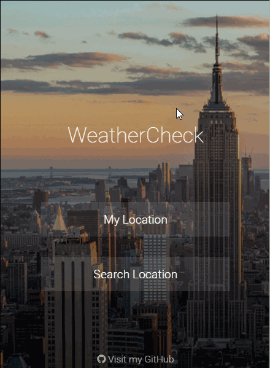

# Weather App with ReactJS
#### Weather App made with ReactJS and the Redux architecture



## Important Note

A key is required to access the accuweather API but there's a public one you can use for testing (like i did) and its included in the proper file so there's no need to do anything.

## Install

```sh
$ npm install
```

## Usage
```sh
$ npm run server
```

```sh
$ localhost:8080
```
